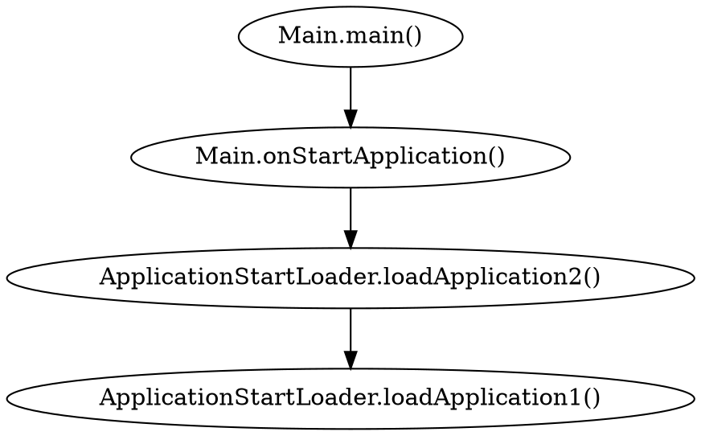

# Drawing Graphs with DOT

```zsh
dot -Tpng basic.gv -o new.png
```

dot and gv file formats are OK. But gv is preferred.

dot accepts input in DOT language. The language describes three main kinds of objects.

- graphs
- nodes
- edges

 digraph : directed graphs
 subgraph : subgraph within a main graphs
  
## Attributes

### shape

shape attribute only applies to node, not edges.

Polygon based
[shape=box]
box shaped node

[shape=circle]
circle shaped node

[shape=plaintext]
no border node

Ex: nodeA[shape=box]

Record based

- record
- Mrecord

### label

{} separates text vertically
struct2 [shape=record,label="{one|two}"];

| by default separates text horizontally.

### color

[color="orchid"]
[color="0.8396,0.4862,0.8549"]
[color="#DA70D6"]
All specify the same color.

### fillcolor

[fillcolor="orchid"]
color inside node, edge.

### fontname

[fontname="Courier New"]
[fontname="Arial"]
[fontname="Impact"]

default:"Times-Roman"

### style

[style="filled"]
[style="dotted"]
[style="bold"]
[style="invis"]

## Drawing orientation, size and spacing

### Size of a dot drawing

`nodesep=0.5`
separation between nodes

`rankdir=LR`
draw graph from left to right

`rankdir=RL`
draw graph from right to left

`rankdir=TD`
draw graph from top to down

`ranksep=equally`
equal rank separation

`ranksep="1.0 equally"`
equal rank separation with 1.0 inch

`ranksep=2`
rank separation with 2.0 inch

## Advanced Features

### Node ports

A node port is a point where edges can attach to a node. (By default edge connects to the center of node)
Ports based on the 8 compass points "n", "ne","e", "se", "s", "sw", "w" or "nw" can be specified for any node.

### Clusters

A cluster is a subgraph placed in its own distinct rectangle of the layout.

## Applications

### Simple Graph



### Simple UML diagram

```code
digraph g{

    customer [shape=record, label="{Customer| {-CustomerID: int \n -CustomerName: String \n -Address: String \n -Phone : int} | +AddCustomer() \n +EditCustomer() \n +DeleteCustomer()}"]
    order [shape=record, label="{Order| {-OrderID: int \n -CustomerID: int \n -CustomerName: String \n -ProductID : int \n Amount: int} | +CreateOrder() \n +EditOrder()}"]
    
    customer -> order    
}
```

### Binary Search Tree

```code

/*Node ports*/

digraph bst {
    node[shape="record"] /*global options for node*/
    nodeA[label="<lptr> | A | <rptr>"]
    nodeB[label="<lptr> | B | <rptr>"]
    nodeC[label="<lptr> | C | <rptr>"]
    nodeD[label="<lptr> | D | <rptr>"]
    
    nodeB:lptr-> nodeA
    nodeB:rptr -> nodeC
    nodeC:rptr -> nodeD
}

```

### Subgraphs

```code

digraph bst {
    
    start
    
    subgraph cluster0{
    nodesep=0.5
    rankdir=TD;
    node[shape="record"] /*global options for node*/
    nodeA[label="<lptr> | A | <rptr>"]
    nodeB[label="<lptr> | B | <rptr>"]
    nodeC[label="<lptr> | C | <rptr>"]
    nodeD[label="<lptr> | D | <rptr>"]
    
    nodeB:lptr-> nodeA
    nodeB:rptr -> nodeC
    nodeC:rptr -> nodeD
    
    }
    
    subgraph cluster1{
    nodesep=0.5
    rankdir=TD;
    node[shape="record"] /*global options for node*/
    nodeE[label="<lptr> | A | <rptr>"]
    nodeF[label="<lptr> | B | <rptr>"]
    nodeG[label="<lptr> | C | <rptr>"]
    nodeH[label="<lptr> | D | <rptr>"]
    
    nodeF:lptr-> nodeE
    nodeF:rptr -> nodeG
    nodeG:rptr -> nodeH
    }
   
   start->nodeB
   start->nodeF
}
```
