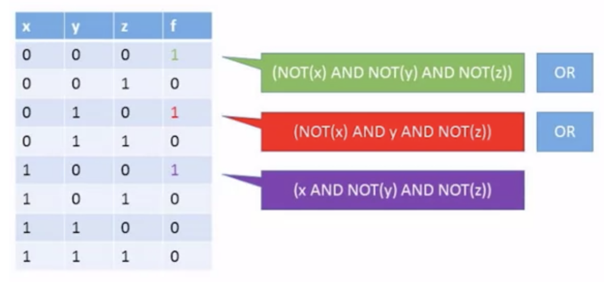

# Boolean Logic

## AND

x and y

x y and
0 0  0
0 1  0
1 0  0
1 1  1

## OR

x or y

x y  or
0 0  0
0 1  1
1 0  1
1 1  1

## NOT

x not
0  1
1  0

1 and (0 or (not 1)) = 1 and (0 or 0) = 1 and 0 = 0

## Boolean Function Synthesis

### Truth table to Boolean Expressions

### Theorem

Any boolean function can be represented using an expression containing AND and NOT operations.

### NAND

NAND(x,y) = NOT(x AND y)

x y NAND
0 0  1
0 1  1
1 0  1
1 1  0

Any boolean function can be represented using an expression using only NAND operations.