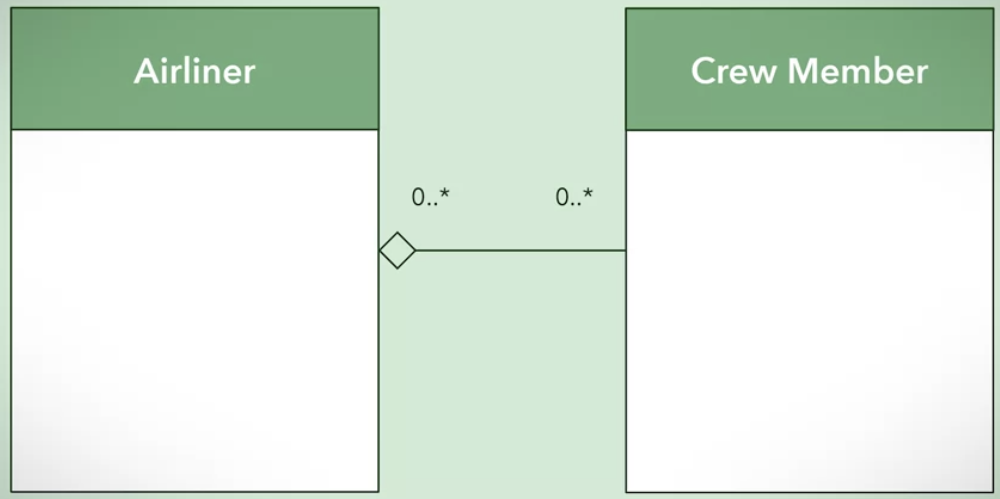
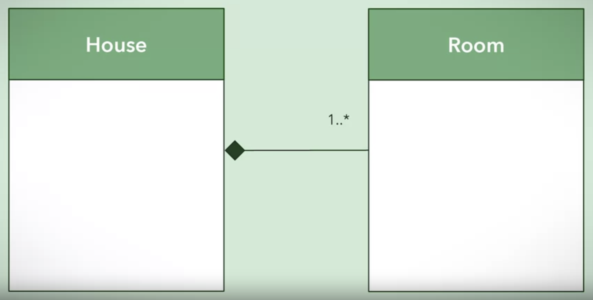
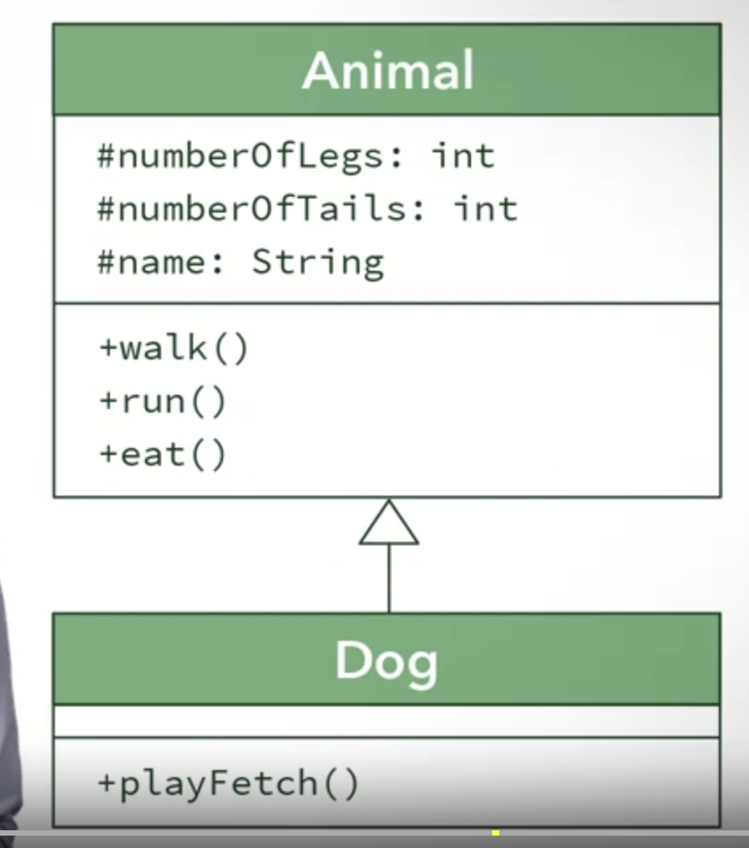
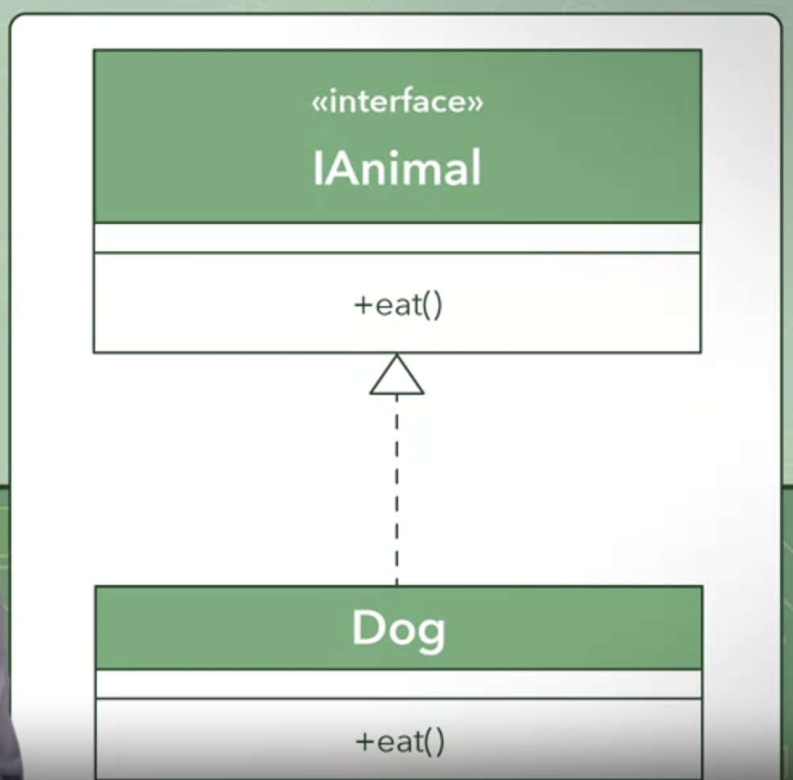
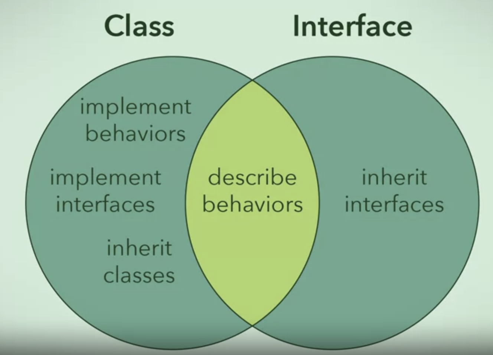

# UML class diagrams

Class - A class symbolize a concept which encapsulates state(attributes) and behavior(operations).
Class in UML is represented by
    a) Class name
    b) Class Attributes
    c) Class Operations

## Implementing Encapsulation

Access Modifier
    + : public
    - : private
    # : protected
    ~ : package
    / : derived
   underlined : static

## Multiplicity
    
    1 --- 0..* left side 1 class is associated with 0 or more classes on right

## Implementing Decomposition

There are three types of relationships found in decompostion

* Association
    If one object is destroyed the other can continue to exist.

    ```java
    //Here student can exist independent of the food
    public class Student{
        public void play(Sport sport){

        }
    }
    ```

* Aggregation
    Weak has-a relationship where parts are not heavily linked, and both can exist independently.
    

    Empty diamond denotes which class in whole.

    ```java
    //airliner can have 0 or more crew members. Airliner and crew are not heavily linked and can exist both without another.
    public class Airliner{
        private ArrayList<CrewMember> crew;

        public Airliner(){
            crew = new ArrayList<CrewMember>();
        }

        public void add(CrewMember crewMember) { ... }
    }
    ```

* Composition
    Strong has-a relationship. And whole cannot exist without parts.
    

    Filled diamond denotes which class in whole.

    ```java
    // Brain object is created at the same time as human object is.
    public class Human{
        private Brain brain;

        public Human(){
            brain = new Brain();
        }
    }
    ```

## Implementing Generalization

### Generalization Using Inheritance

Class connected with arrow, with superclass(class which factors out commonality) connected at the head of the arrow and subclass at the tail.


'#' signifies that attribute or method is protected. And can be accessed only by

* The encapsulating class itself
* All subclasses
* All classes within the same package

```java
//abstract will prevent Animal object to be created
public abstract class Animal{
    protected int numberOfLegs;
    protected int numberOfTails;
    protected String name;

    public Animal(String petName, int legs, int tails){
        this.name = petName;
        this.numberOfLegs = legs;
        this.numberOfTails = tails;
    }

    public void walk(){ ... }
    public void run(){ ... }
    public void eat(){ ... }
}

public class Dog extends Animal{
    public Dog(String name, int legs, int tails){
        super(name,legs,tails);
    }

    public void playFetch(){ ... }
    public void walk(){ ... } //Override
}

//implilict constructor - constructor not defined by user
public abstract class Animal{
    protected int numberOfLegs;

    public void walk(){ ... }
}

//explicit constructor - constructor defined by user
public abstract class Animal{
    protected int numberOfLegs;

    public Animal(int legs){
        this.numberOfLegs = legs;
    }
}

```
Java does not allow multiple inheritance, as it can result in data abiguity.

### Generalization using Interfaces

An interface only declares method signatures and no constructors, attributes or method bodies.
Interfaces are not classes, and are used to list behaviors.
Interface is connected to a class using a dotted arrow in UML. And interface is always on top of class.

```java
public interface IAnimal{
    public void move();
    public void speak();
    public void eat();
}

public class Dog implements IAnimal{
    //attributes

    public void move(){ ... }
    public void speak(){ ... }
    public void eat(){ ... }
}
```



```java
//extending interfaces
public interface IVehicleMovement{
    public void moveOnX();
    public void moveOnY();
}

//for submarines and planes
public interface IVehicleMovement3D extends IVehicleMovement{
    public void moveOnZ();
}
```

